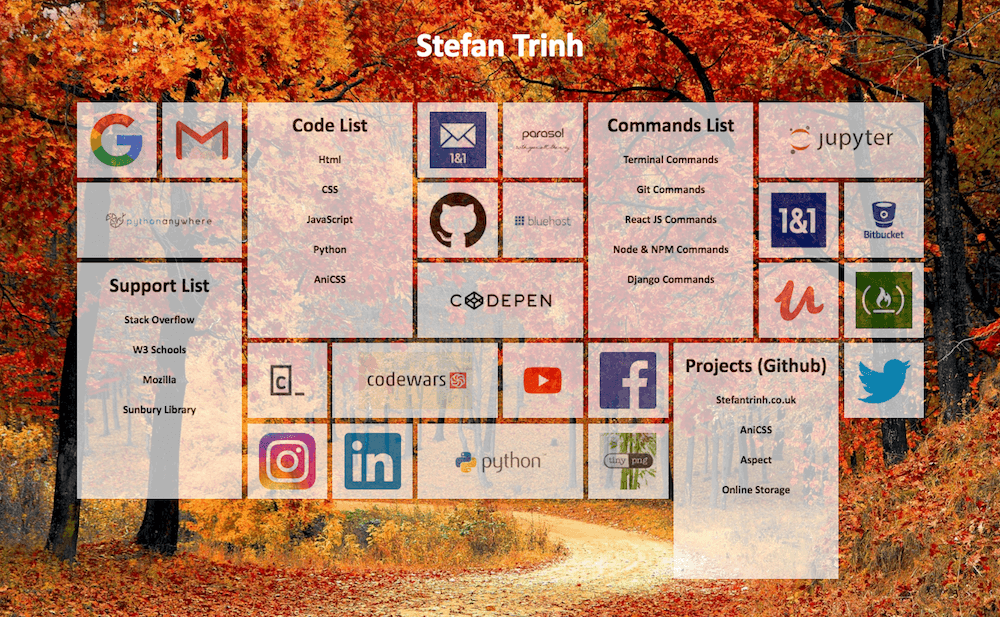

# Personal Directory

Run out of room on your favourites bar?
Is everything too nested?
Have too many links you use regularly?

Why not use a Personal Directory with everything you need displayed on one Browser page.

A Personal Directory page that uses a grid system to display favourite links. It is currently tailored to a web developer user but can be arranged to make your own personal directory that suits your needs. it has single image grids and large image grids for lists.

## Benefits

- Improve your workflow with a personal directory having all your neccessary links and tools in one place.
- Clean and easy to see visual grid display.
- Customisable Grid
- Responsive Design(Works on Desktop and Mobile).

## How to Install

Basic knowledge of HTML and CSS needed to customise to your own specification.

1. Copy the entire folder and put in your local drive.
2. Open the file "index.html" with the web broswer of your choosing(or drag the Html into the broswer and then bookmark the page to the favourites bar).
3. Edit the HTML and CSS to suit your needs.

## Construction

- Html
- CSS Grid
- [AniCSS](https://github.com/stefantrinh1/AniCSS)

## Plans To Include

This project will be moved into a React JS application rather than static webpage in the future.
It will have options to include which widget/component the user wants and lets them customise it and add it to their directory.
eventually it will also have to option log in.

- Weather Section
- Filter Function
- News Feeds
- Calender
- Calculator
- Current Times
- To Do list
- Small gallery slide sho
- Countdown to certain dates
- Notepad
